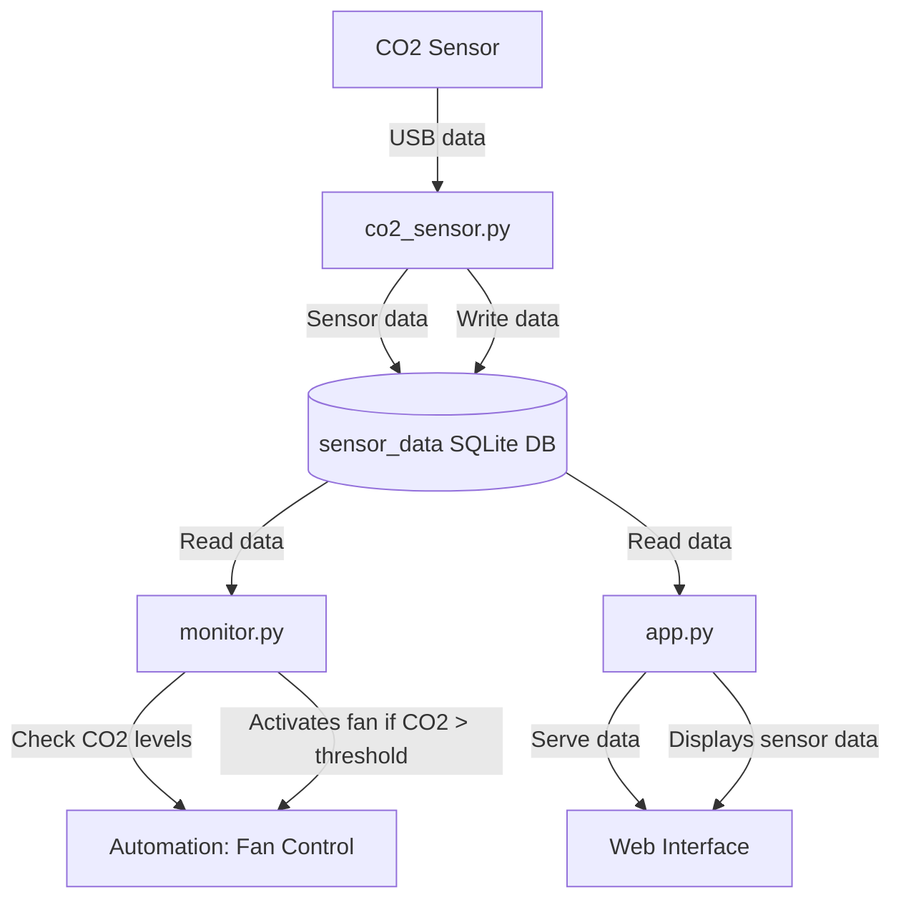

# CO2 Sensor Monitoring Script

This repository contains a Python-based project for monitoring CO2 levels, temperature, and humidity using a USB-zyTemp CO2 sensor connected to a Raspberry Pi. The project includes automated control (e.g., turning on a fan when CO2 levels exceed a threshold) and a web service for visualizing sensor data in real time.



### Explanation of Each Component

- **CO2 Sensor**: The physical sensor device connected via USB.
- **`co2_sensor.py`**:
  - Reads data from the CO2 sensor.
  - Writes CO2, temperature, and humidity readings to the SQLite database (`sensor_data`).
- **`sensor_data` SQLite DB**:
  - Stores the CO2, temperature, and humidity readings for logging and analysis.
- **`monitor.py`**:
  - Reads data from the database.
  - Checks if CO2 levels exceed a set threshold, and triggers the **Fan Control** if necessary.
- **`app.py`**:
  - Reads data from the database.
  - Serves the data to the **Web Interface** via a Flask web server.
- **Web Interface**:
  - Displays real-time CO2, temperature, and humidity data.

## Features

- **CO2 Monitoring**: Reads CO2 levels (in ppm) from the sensor.
- **Temperature Monitoring**: Reads temperature data (in °C).
- **Humidity Monitoring**: Reads humidity data (in %).
- **Data Logging**: Logs sensor data to an SQLite database.
- **Automation**: Automatically activates a fan when CO2 levels exceed a set threshold.
- **Web Interface**: Serves a simple web interface to visualize sensor data in real time.

## Requirements

- Raspberry Pi (tested on Raspberry Pi Zero W)
- USB-zyTemp CO2 sensor (Holtek Semiconductor)
- Python 3.x
- Python packages:
  - `hidapi`
  - `Flask`
  - `sqlite3`
  - `datetime`

## Setup and Installation

1. **Clone the repository**:
```bash
   git clone https://github.com/isheglov/co2-sensor-script.git
   cd co2-sensor-script
   cp .env.dist .env
   ```

2. **Set up your Python environment**:

If you are using a virtual environment, create and activate it:
```bash
python3 -m venv hid_env
source hid_env/bin/activate
```

3. **Install the required packages**:
```bash
pip install -r requirements.txt
```

4. **Create the SQLite Database**: 

Run createDB.py to initialize the database:
```bash
python3 createDB.py
```

5. **Connect the CO2 Sensor**:

Ensure the USB-zyTemp CO2 sensor is connected to the Raspberry Pi.

6. **Run the script**:
```bash
python3 co2_sensor.py
```

7. **Start the Web Server**:

Run the Flask app to start the web interface:
```bash
python3 web_service/app.py
```
By default, the web server will run on http://localhost:5000. You can access this in a browser to view real-time CO2, temperature, and humidity data.

## Running Automation for Fan Control

To automatically activate a fan when CO2 levels exceed a specified threshold, run the monitor.py script in the automation/ folder. This script will continuously monitor sensor readings and trigger the fan when necessary.
```bash
python3 automation/monitor.py
```

## Running as a Background Service (Optional)

To continuously run the script in the background on a Raspberry Pi using systemd, follow these steps:

1. Create a systemd service file:
```bash
sudo nano /etc/systemd/system/co2sensor.service
````

2. Add the following content:

```ìni
[Unit]
Description=CO2 Sensor Monitoring Service
After=network.target
[Service]
ExecStart=/home/pi/myenv/bin/python /home/pi/co2_sensor.py
WorkingDirectory=/home/pi/
StandardOutput=inherit
StandardError=inherit
Restart=always
User=pi
[Install]
WantedBy=multi-user.target
```
3. Enable and start the service:

```bash
sudo systemctl daemon-reload
sudo systemctl enable co2sensor.service
sudo systemctl start co2sensor.service
```

## Web Interface

The web interface provides real-time data visualization and displays the current CO2, temperature, and humidity readings. Access it at http://localhost:5000 (or replace localhost with your Raspberry Pi’s IP address if accessing from another device).

```bash
sudo systemctl restart myapp.service
```

### Web Pages:

- **/**: Main dashboard for real-time data visualization.
- **/current**: Shows the latest sensor readings.

## License

This project is licensed under the MIT License - see the [LICENCE](LICENSE) file for details.

## Contributing

Contributions are welcome! Please fork the repository and submit a pull request.

## Contact

If you have any questions or issues, feel free to open an issue in the repository or contact me directly.
